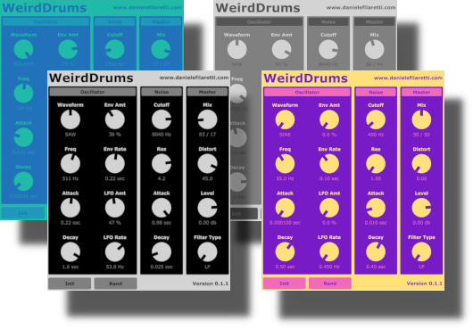

# WeirdDrums Free

A free and open source little drum synth plugin inspired by the awesome [Sonic Charge Microtonic](https://soniccharge.com/microtonic), one of my favourite plugins. All sounds are synthesised in realtime - no samples used!

Here some audio examples (more to come!):

* [boredom](http://danielefilaretti.com/downloads/misc/LittleTeknoDrummer-examples/boredom.mp3)
* [slow-techno](http://danielefilaretti.com/downloads/misc/LittleTeknoDrummer-examples/slow-techno.mp3)
* [electro-1](http://danielefilaretti.com/downloads/misc/LittleTeknoDrummer-examples/electro-1.mp3)
* [electro-2](http://danielefilaretti.com/downloads/misc/LittleTeknoDrummer-examples/electro-2.mp3)
* [gabba](http://danielefilaretti.com/downloads/misc/LittleTeknoDrummer-examples/gabba.mp3)
* [tek](http://danielefilaretti.com/downloads/misc/LittleTeknoDrummer-examples/tek.mp3)

## Builds

Coming soon! (in the meanwhile... build it yourself, or drop me a line if need help!)

## Architecture / how to use

As in the original Mictoronic, the architecture is quite simple. 
We have essentially an _oscillator_ section and a _noise_ section, which gets mixed together and finally processed in the _master_ section. 
In a bit more detail...

* **oscillator section**: oscillator -> Attack-Decay (AD) envelope. Oscillator waveform can be sine, saw or square. If desired, the oscillator pitch can be modulated via a second AD envelope and/or an LFO. More modulation options may become available in future. 

* **noise section**: white noise generator -> filter -> AD envelope. The filter can be Low-Pass (LP), High-Pass (HP) or Band-Pass (BP) and its cutoff frequency and envelope are adjustable via the corresponding sliders. Later: more envelope shapes. 

* **master section**: here the _oscillator_ and _noise_ signal are mixed together (via the _mix_ slider) and some effects and global level/pan are applied. Currently only distortion is available, but we may add more in future. 

Finally we have to handy buttons:

* the **init** button restores the patch to its initial value
* the **randomize** button gives you a completely random sound (notice that all parameters are randomized except for the *level*, which is kept unchanged). 

## Faq

### Why there is no step-sequencer? And why there aren't multiple "drum pads" like in most other drum instruments?

Yes - one instance of this plugin = 1 single drum sound, and there is no built-in step sequencer, meaning you need to use your DAW's piano roll or editor to input notes. 

Here are some of the reasons for this:

* OK let's be honest here, this started as a learning/practice project, so I wanted to keep it simple :-) 

* Although I'm a big fan of drum synth plugins, I pretty much never use their built-in step sequencer, but instead I rely on my DAW's editor. Related to that, I recently bought an Ableton Push2 meaning the drum sequencing workflow is heavily based on Drum Racks. With this setup an additional step sequencer just be redundant for me. 

* When working on my tracks I often find myself loading a Microtonic instance just to make a single sound (leaving 7 of the 8 pads unused). Or, perhaps, sometimes I only use 4 of the 8 pads, while some other times I may need 10/15/50 etc. With this approach you get more flexibility: just load as many instances as you want, and use and route them in any way you see fit. For example, I usually open up a Drum Rack in Ableton and add a bunch of LittleTeknoDrummer instances, then mix and match with samples and other instruments. 

Having said that, a step sequencer sounds like a nice future addition and a great learning exercise ;) 

### What about presets?

WeirdDrums Free currently has no presets. Instead, we encourage you to experiment!! 
Suggested workflow: press the **init** button to reset the patch, then tweak the parameters until you got something you like - the layout is quite simple and everything fits in one page, so it shouldn't be too hard to keep track of things. 
For some crazyness, use the **randomize** button instead 😊

## Todo / Contributions

Contributions, feature requests, bug reports as well as general feedback and advice are very welcome!

Here are a few needed improvements that comes to mind...

* envelopes are linear, but should be exponential (or, at least, offer the choice!) 
* dedicated envelope type for claps 
* global EQ
* Optimize performance
* ..... 

For more details, please take a look at the [issues](https://github.com/dfilaretti/LittleTeknoDrummer/issues) and feel free to open new ones is needed. 
Also, do not hesitate to send pull requests or drop me a line! 
