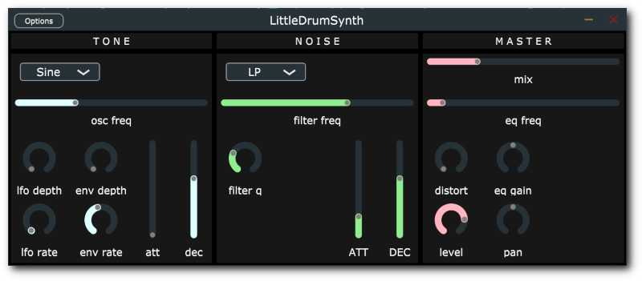

# LTD - Little Tekno Drummer

A simple drum synthesiser plugin inspired by the awesome [Sonic Charge Microtonic](https://soniccharge.com/microtonic), one of my favourite plugins.
All sounds are synthesised in realtime, no samples are used. 

It is written in C++ and the [JUCE](https://juce.com/) framework. 

Audio examples (more to come!):

* [Example 1](https://dfilaretti.github.io/assets/loop1.wav)
* [Example 2](https://dfilaretti.github.io/assets/loop2.wav)
* [Example 3](https://dfilaretti.github.io/assets/loop3.wav)

## Architecture / how to use

As the Mictoronic, the architecture is quite simple. We have essentially three components

* **oscillator section**: this offers a single oscillator with a selectable waveform (currently sine, saw and square), whose amplitude is modulated by a simple "percussive style" Attack-Decay (AD) envelope. In addition, the pitch of the oscillator can also be modulated via a second AD envelope and/or a simple sine-wave LFO. More modulation options may become available in future. 

* **noise section**: this consists of a white noise generator going through a filter and finally through an AD envelope. The filter can be Low-Pass (LP), High-Pass (HP) or Band-Pass (BP) and its cutoff frequency and envelope are adjustable. 

* **master section**: this is where the _oscillator_ and _noise_ signal are mixed together (via the _mix_ slider) and some effects and global volume adjustments are applied. 

## Faq

### Why there is no step-sequencer?

There are essentially two reasons for that: 

* This started as a learning/practice project. I wanted to keep it simple :-) 

* Although the Microtonic (as well as many other drum synths) have one, and although I'm a big fan of those plugins, I pretty much never use the built-in step sequencer, instead using my DAW's built in piano-roll/sequencing features. Also I recently got myself an Ableton Push2 so that's my primary drum sequencer now. 

Having said that, a step sequencer sounds like a nice future addition and a great learning exercise. 

### This kind of plugins normally gives you at least 8 sounds. What about this? Is it only 1 sound? 

Yes. One instance of this plugin = 1 single drum sound. 

Reasons:

* Again, try to keep things simple!

* When working on my tracks I often found myself opening up a Microtonic just to make a single sound (rather than the full 8-drums drumkit). Or sometimes I use only 4 of the 8 slots. Or sometimes I need 50 slots (no, not really). So, with this approach you get more freedom flexibility on how you want to use the instrument. Load as many instances as you want, and use them as you want. For example, I like to load them inside Ableton's Drum Rack, perhaps together with other things such as samples etc. 

## Todo / Contributions

Although already usable, this is still a work in progress. 
It has many missing features and it possibly (certainly?) contains bugs. 

Contributions, feature requests, bug reports as well as general feedback and advice are very welcome. 

Please feel free to open an issue or submit a pull reques. 
